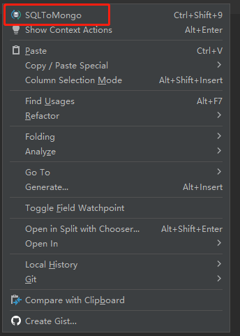
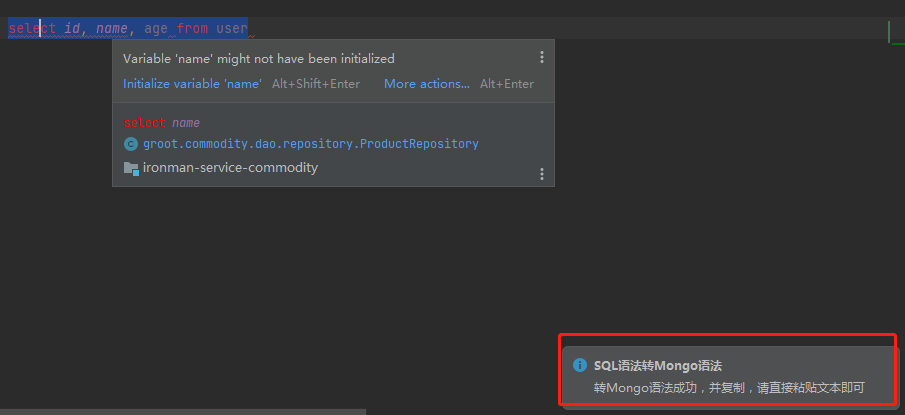
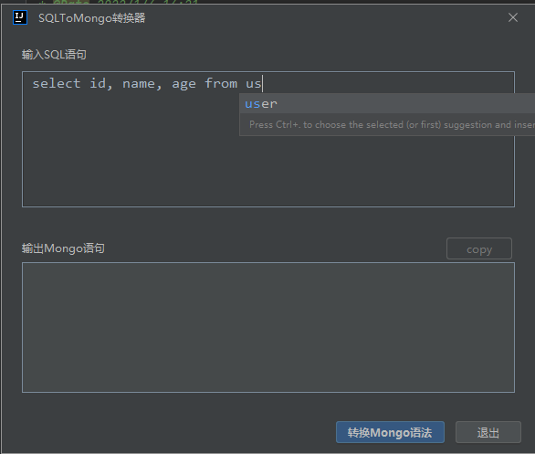
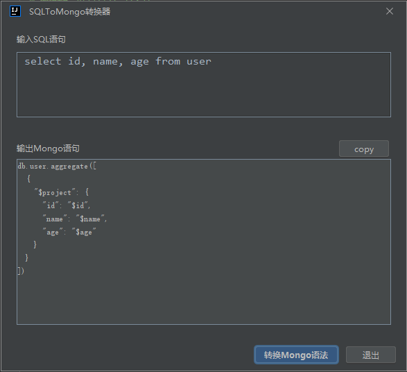

# sqltomongo-plugin

<!-- Plugin description -->

一款用于将SQL语句翻译成Mongo语法的 idea 插件

# SQLToMongo 中文
将SQL语句翻译成Mongo语法的插件  
转换功能代码仓库：https://gitee.com/listen_w/sqltomongo-converter.git  
插件代码仓库：https://gitee.com/listen_w/sqltomongo-plugin.git
   
掘金个人博客：https://juejin.cn/user/3737995265185528

# 使用

- 安装插件
- 选中要执行的SQL，右键，选择“SQLToMongo”，然后就会将翻译好的结果复制下来，找个空白的地方粘贴即可
- 或者不选中任何字符，右键，选择“SQLToMongo”，弹出对话框，在对话框完成翻译SQL过程

# 特性
- 支持大部分的SQL语句，比如 select、join、where、group、limit、order by、having、sort等。
- 不支持 select * ，使用具体的字段

<!-- Plugin description end -->
